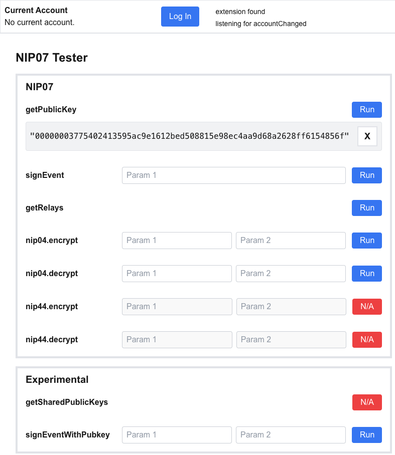

# NIP07 Signing Extension Tester

This web app tests NIP07 signing extensions.

- Shows which functions are supported by current extension in the browser
- Shows result of calling individual functions
- Demonstrates a sample Login / Sign Out for React Nostr clients



This is a [Next.js](https://nextjs.org) project bootstrapped with [`create-next-app`](https://nextjs.org/docs/app/api-reference/cli/create-next-app).

## Getting Started

First, run the development server:

```bash
npm run dev
# or
yarn dev
# or
pnpm dev
# or
bun dev
```

Open [http://localhost:3000](http://localhost:3000) with your browser to see the result.
